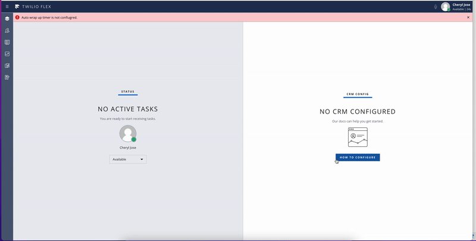
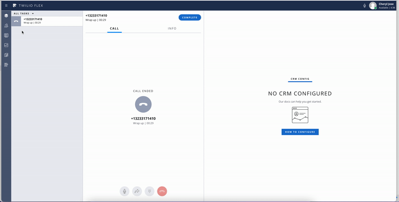

<a href="https://www.twilio.com">

</a>

# Twilio Flex Plugin - Auto complete during wrap up

Twilio Flex Plugins allow you to customize the appearance and behavior of [Twilio Flex](https://www.twilio.com/flex). If you want to learn more about the capabilities and how to use the API, check out our [Flex documentation](https://www.twilio.com/docs/flex).

This plugin will automatically complete the task during the wrap up phase. The time for the task to be completed can be configured using ui_attributes. This [documentation](https://www.twilio.com/docs/flex/developer/ui/configuration#modifying-configuration-for-flextwiliocom) provides information on how to configure the ui_attributes.

Sample demo is provided below :

The plugin will first check if the configuration for auto wrapup timer is defined or not. If the configuration
is not found within ui_attributes then we will show a notification as below:


Any incoming task will be completed as shown below :



## Dependencies

This plugin relies on custom configuration being applied to your underlying [Flex Configuration](https://www.twilio.com/docs/flex/developer/ui/configuration#modifying-configuration-for-flextwiliocom)

For each channel you want to add an entry to the following ui_attributes element.

```bash
"autoWrapupTimer": {
  "channel name" :  {
    "enabled" : "true or false",
    "maxSeconds": "time for auto complete"
  }
}
```

For example :

```bash
"autoWrapupTimer": {
  "voice": {
    "enabled": true,
    "maxSeconds": 30
  },
  "chat": {
    "enabled": false
  }
}
```


## Requirements

To deploy this plugin, you will need:

- An active Twilio account with Flex provisioned. Refer to the [Flex Quickstart](https://www.twilio.com/docs/flex/quickstart/flex-basics#sign-up-for-or-sign-in-to-twilio-and-create-a-new-flex-project") to create one.
- npm version 5.0.0 or later installed (type `npm -v` in your terminal to check)
- Node.js [long term support(LTS) version](https://nodejs.org/en/about/releases/)(type `node -v` in your terminal to check)

## Setup

Make sure you have [Node.js](https://nodejs.org) as well as [`npm`](https://npmjs.com) installed.

1.  Clone this repo:

```bash
https://github.com/twilio-professional-services/plugin-autoComplete-wrapup.git
```

2. Setup flex configuration as mentioned above under dependencies.

In order to do this you need to first get the flex configuration, you can do that by:

```bash
curl -X GET 'https://flex-api.twilio.com/v1/Configuration' \
-u $TWILIO_ACCOUNT_SID:$TWILIO_AUTH_TOKEN
```

Copy the ui_attributes portion from the response you get and make the POST request with the updates to the ui_attributes

```bash
curl -X POST 'https://flex-api.twilio.com/v1/Configuration' \
-u $TWILIO_ACCOUNT_SID:$TWILIO_AUTH_TOKEN \
-H 'Content-Type: application/json' \
-d '{
  "account_sid":"Add your flex account sid here",
  "ui_attributes": {
    "Add the aautoWrapupTimer rule as shown in the section above",
    ...old properties continued
  }
}'
```

3. Go to the plugin directory

```bash
cd plugin-autoComplete-wrapup
```

4. Install the dependencies

```bash
npm install
```

5. Run plugin on a local environment using Twilio CLI :

```bash
twilio flex:plugins:start
```

6. Deploy your plugin to your Flex project using Twilio CLI:

```bash
twilio flex:plugins:deploy --major --changelog "Notes for this version" --description "Functionality of the plugin"
```

More detailed information about deploying Flex plugins can be found here: https://www.twilio.com/docs/flex/developer/plugins/cli/deploy-and-release
